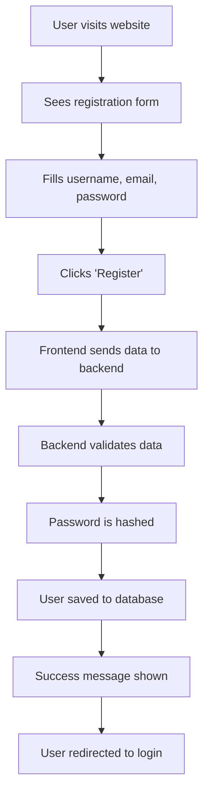
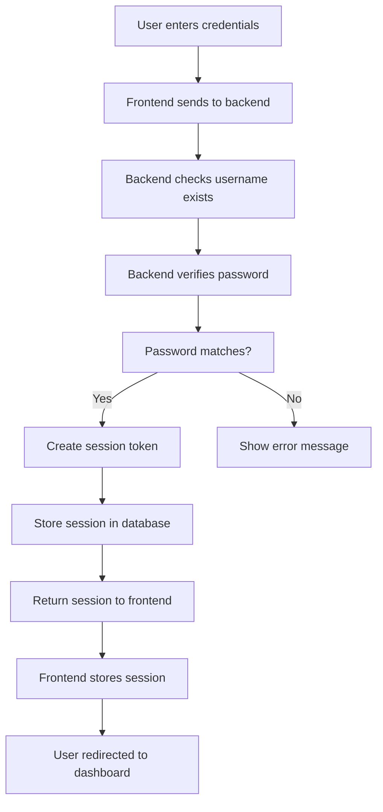
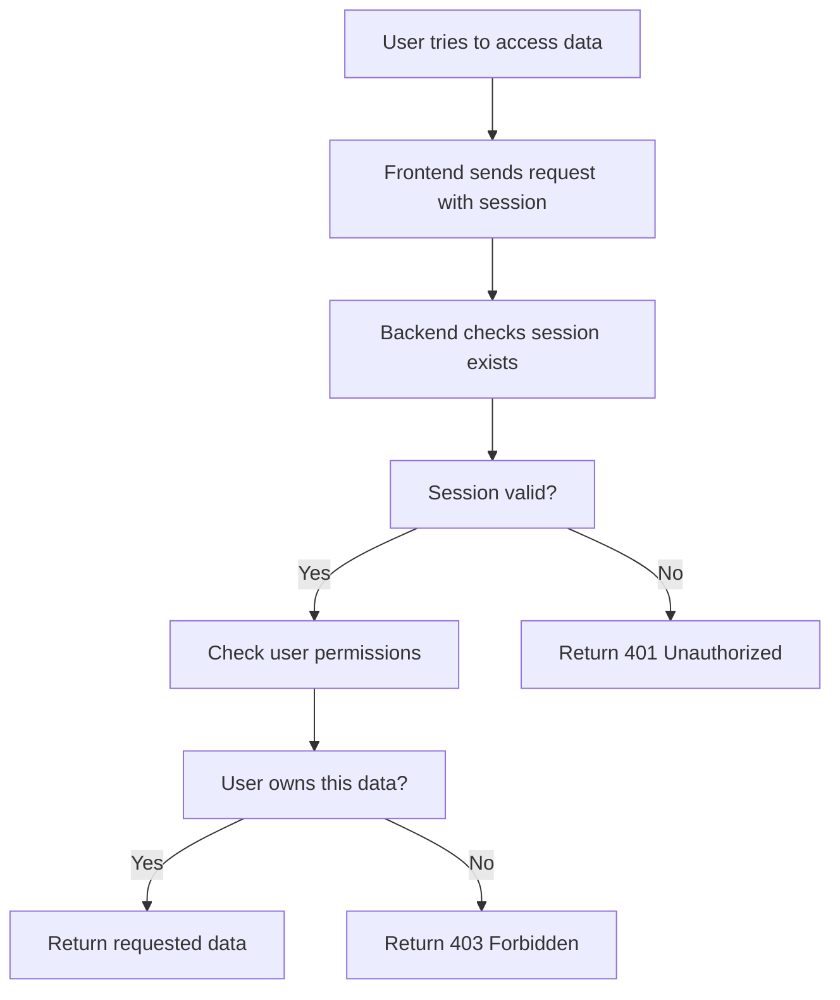
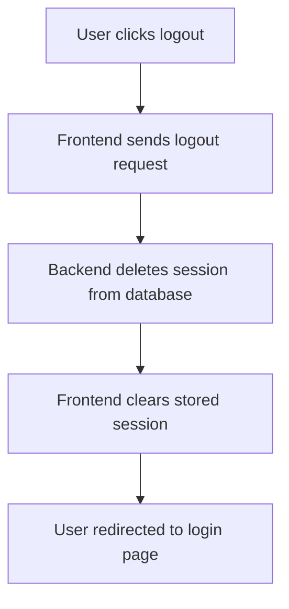

# 🔐 Authentication System Explained: From Beginner to Expert

*A complete guide to understanding how user authentication works in the AI Data Science Platform*

---

## 📚 Table of Contents

1. [What is Authentication? (The Basics)](#what-is-authentication-the-basics)
2. [Why Do We Need Authentication?](#why-do-we-need-authentication)
3. [How Authentication Works (Simple Explanation)](#how-authentication-works-simple-explanation)
4. [Our Platform's Authentication System](#our-platforms-authentication-system)
5. [The Technical Implementation](#the-technical-implementation)
6. [Step-by-Step Authentication Flow](#step-by-step-authentication-flow)
7. [Security Features](#security-features)
8. [How Different Parts Work Together](#how-different-parts-work-together)
9. [Advanced Concepts](#advanced-concepts)
10. [Troubleshooting Common Issues](#troubleshooting-common-issues)

---

## What is Authentication? (The Basics)

### 🤔 Think of it like a House Key

Imagine you have a house with a front door that has a lock. To get inside, you need:
1. **A key** (your password)
2. **The right key** (correct password)
3. **The key must work** (valid user account)

Authentication is exactly like this, but for computer systems!

### 📝 Simple Definition

**Authentication** is the process of proving who you are to a computer system. It's like showing your ID card to enter a building, but instead of a physical card, you use:
- Username + Password
- Or other secure methods

### 🔑 Key Terms You'll See

- **User**: A person who wants to use the system (that's you!)
- **Login**: The process of entering your username and password
- **Session**: A temporary "permission slip" that lets you use the system
- **Token**: A digital "key" that proves you're logged in
- **Logout**: Ending your session and returning the "key"

---

## Why Do We Need Authentication?

### 🛡️ Security Reasons

1. **Keep Data Private**: Only you should see your data
2. **Prevent Unauthorized Access**: Stop strangers from using your account
3. **Track Who Did What**: Know which user performed which actions
4. **Comply with Laws**: Many regulations require user authentication

### 🏠 Real-World Analogy

Think of a library:
- **Without authentication**: Anyone can check out books in your name
- **With authentication**: Only you can check out books with your library card

### 💼 Business Reasons

- **User Management**: Know who your users are
- **Usage Analytics**: Understand how people use your platform
- **Billing**: Charge the right people for services
- **Support**: Help specific users with their problems

---

## How Authentication Works (Simple Explanation)

### 🎭 The Theater Ticket Analogy

Imagine going to a theater:

1. **Buy a Ticket** (Register for an account)
   - You give your name and pay money
   - You get a ticket with your seat number

2. **Show Your Ticket** (Login)
   - At the door, you show your ticket
   - The usher checks if it's valid
   - You're allowed inside

3. **Keep Your Ticket** (Session)
   - You keep the ticket during the show
   - It proves you belong there
   - You can move around the theater

4. **Leave the Theater** (Logout)
   - You throw away your ticket
   - You're no longer allowed back in

### 🔄 The Digital Version

1. **Register**: Create account with username/password
2. **Login**: Enter credentials, get a digital "ticket" (session)
3. **Use System**: Show your "ticket" for each action
4. **Logout**: Throw away your "ticket"

---

## Our Platform's Authentication System

### 🏗️ The Big Picture

Our AI Data Science Platform has a **3-layer authentication system**:

```
┌─────────────────────────────────────────┐
│           FRONTEND (Browser)            │
│  • Login/Register Forms                 │
│  • Session Storage                      │
│  • User Interface                       │
└─────────────────┬───────────────────────┘
                  │
┌─────────────────▼───────────────────────┐
│           BACKEND API                   │
│  • Authentication Logic                 │
│  • Session Management                   │
│  • User Validation                      │
└─────────────────┬───────────────────────┘
                  │
┌─────────────────▼───────────────────────┐
│           DATABASE                      │
│  • User Accounts                        │
│  • Session Storage                      │
│  • Data Isolation                       │
└─────────────────────────────────────────┘
```

### 🧩 The Components

1. **Frontend (What You See)**
   - Login page
   - Registration page
   - Dashboard
   - Logout button

2. **Backend (The Brain)**
   - Checks if passwords are correct
   - Creates and manages sessions
   - Protects data access

3. **Database (The Memory)**
   - Stores user accounts
   - Remembers who's logged in
   - Keeps data separate for each user

---

## The Technical Implementation

### 🗂️ File Structure

```
backend/
├── app/
│   ├── api/
│   │   └── simple_auth.py          # Login/Register endpoints
│   ├── core/
│   │   └── auth_middleware.py      # Authentication logic
│   ├── models/
│   │   └── session.py              # Database models
│   └── services/
│       └── session_service.py      # Session management
frontend/
├── lib/
│   └── simple-auth-context.tsx     # Frontend authentication
└── app/
    └── page.tsx                     # Main dashboard
```

### 🔧 Key Technologies Used

1. **FastAPI** (Backend Framework)
   - Handles HTTP requests
   - Manages API endpoints
   - Provides security features

2. **Next.js** (Frontend Framework)
   - Creates user interfaces
   - Manages client-side state
   - Handles routing

3. **SQLite** (Database)
   - Stores user data
   - Manages sessions
   - Ensures data persistence

4. **JWT-like Sessions** (Security)
   - Creates secure tokens
   - Validates user identity
   - Manages session expiration

---

## Step-by-Step Authentication Flow

### 🚀 Step 1: User Registration



**What happens behind the scenes:**
1. User fills out registration form
2. Frontend sends data to `/api/auth/register`
3. Backend checks if username/email already exists
4. Password is encrypted (hashed) for security
5. User account is created in database
6. Success message is shown

### 🔑 Step 2: User Login



**What happens behind the scenes:**
1. User enters username and password
2. Frontend sends to `/api/auth/login`
3. Backend finds user in database
4. Backend compares password with stored hash
5. If correct, creates a session token
6. Session is stored in database with expiration time
7. Token is sent back to frontend
8. Frontend stores token and shows dashboard

### 🛡️ Step 3: Using the System (Session Validation)



**What happens behind the scenes:**
1. User tries to access their data
2. Frontend includes session token in request
3. Backend looks up session in database
4. Backend checks if session is still valid (not expired)
5. Backend verifies user owns the requested data
6. If all checks pass, data is returned
7. If any check fails, error is returned

### 🚪 Step 4: User Logout



**What happens behind the scenes:**
1. User clicks logout button
2. Frontend sends request to `/api/auth/logout`
3. Backend deletes session from database
4. Frontend removes session from storage
5. User is redirected to login page

---

## Security Features

### 🔒 Password Security

**Password Hashing:**
- Passwords are never stored in plain text
- They're converted to a "hash" (like a fingerprint)
- Even if database is stolen, passwords can't be recovered

**Example:**
```
Original Password: "mypassword123"
Hashed Version: "a1b2c3d4e5f6..." (impossible to reverse)
```

### ⏰ Session Management

**Session Expiration:**
- Sessions automatically expire after 24 hours
- Users must log in again after expiration
- Prevents indefinite access if someone steals your session

**Session Validation:**
- Every request checks if session is still valid
- Invalid sessions are immediately rejected
- Users are redirected to login if session expires

### 🛡️ Data Isolation

**User-Specific Data:**
- Each user can only see their own data
- Sessions are tied to specific users
- Cross-user access is blocked

**Example:**
```
User A's Data: [Session 1] → [Data A]
User B's Data: [Session 2] → [Data B]
User A cannot access Data B, even with Session 1
```

---

## How Different Parts Work Together

### 🌐 Frontend ↔ Backend Communication

```javascript
// Frontend sends login request
const response = await fetch('/api/auth/login', {
  method: 'POST',
  headers: { 'Content-Type': 'application/json' },
  body: JSON.stringify({ username, password })
});

// Backend responds with session
const { session_id, user_id } = await response.json();

// Frontend stores session for future requests
localStorage.setItem('session_id', session_id);
```

### 🗄️ Backend ↔ Database Interaction

```python
# Backend creates user session
session_id = str(uuid4())
session_data = {
    'session_id': session_id,
    'user_id': user_id,
    'expires_at': datetime.utcnow() + timedelta(hours=24)
}
database.insert('sessions', session_data)
```

### 🔄 Session Validation Flow

```python
# Every request goes through this check
def validate_session(session_id):
    session = database.get_session(session_id)
    if not session or session.expired:
        return None  # Invalid session
    return session.user_id  # Valid session
```

---

## Advanced Concepts

### 🏗️ Middleware Pattern

**What is Middleware?**
Middleware is like a security checkpoint at an airport. Every request must go through it before reaching the actual code.

```python
# Authentication middleware checks every request
@app.middleware("http")
async def auth_middleware(request, call_next):
    # Check if user is authenticated
    user_id = extract_user_from_request(request)
    if not user_id and request.url.path.startswith("/api/"):
        return JSONResponse({"error": "Unauthorized"}, status_code=401)
    
    # Continue to the actual endpoint
    response = await call_next(request)
    return response
```

### 🔐 Session vs Token Authentication

**Session-Based (What We Use):**
- Session stored in database
- Server remembers who's logged in
- Easy to revoke sessions
- More secure for our use case

**Token-Based (Alternative):**
- Token contains user info
- Server doesn't store sessions
- Stateless (no database lookup)
- Better for mobile apps

### 🛡️ Security Headers

**CORS (Cross-Origin Resource Sharing):**
- Controls which websites can access our API
- Prevents malicious websites from stealing data
- Configured to only allow our frontend

**Content Security Policy:**
- Prevents code injection attacks
- Controls which scripts can run
- Protects against XSS attacks

---

## Troubleshooting Common Issues

### ❌ "Session Not Found" Error

**What it means:** Your session has expired or been deleted.

**How to fix:**
1. Try logging in again
2. Check if your session expired (24 hours)
3. Clear browser storage and try again

**Prevention:**
- Don't leave the app open for more than 24 hours
- Log out properly when done

### ❌ "Access Denied" Error

**What it means:** You're trying to access someone else's data.

**How to fix:**
1. Make sure you're logged in with the correct account
2. Don't try to access other users' data
3. Contact support if you believe this is an error

**Prevention:**
- Always log out on shared computers
- Don't share your login credentials

### ❌ "Invalid Credentials" Error

**What it means:** Username or password is incorrect.

**How to fix:**
1. Check for typos in username/password
2. Make sure Caps Lock is off
3. Try resetting your password
4. Contact support if account is locked

**Prevention:**
- Use a password manager
- Choose a strong, memorable password
- Don't share your credentials

### 🔧 Technical Issues

**Database Connection Problems:**
- Check if database is running
- Verify connection settings
- Look for error logs

**Session Storage Issues:**
- Check if database has space
- Verify session table exists
- Check for database locks

---

## 🎯 Summary: How It All Works Together

### The Complete Picture

1. **User registers** → Account created in database
2. **User logs in** → Session created and stored
3. **User uses app** → Every action checks session
4. **Data is isolated** → Users only see their own data
5. **User logs out** → Session is deleted
6. **Security maintained** → Unauthorized access blocked

### Key Benefits

✅ **Secure**: Passwords are encrypted, sessions expire
✅ **Isolated**: Users can't see each other's data
✅ **Reliable**: Sessions are validated on every request
✅ **User-Friendly**: Simple login/logout process
✅ **Scalable**: Can handle many users simultaneously

### What Makes It Special

🔐 **Zero Trust Security**: Every request is verified
👥 **Multi-User Support**: Each user has their own space
⏰ **Automatic Expiration**: Sessions don't last forever
🛡️ **Data Protection**: Strong isolation between users
🔄 **Seamless Experience**: Users don't notice the complexity

---

## 🚀 Next Steps

Now that you understand how authentication works:

1. **Try the system**: Log in and explore the features
2. **Test security**: Try accessing data without logging in
3. **Learn more**: Read about other security concepts
4. **Ask questions**: Don't hesitate to ask for clarification

Remember: Authentication is like the foundation of a house - you don't see it, but it keeps everything secure and stable! 🏠🔐

---

*This document explains the authentication system in the AI Data Science Platform. For technical implementation details, see the source code in the `backend/app/core/auth_middleware.py` and related files.*
