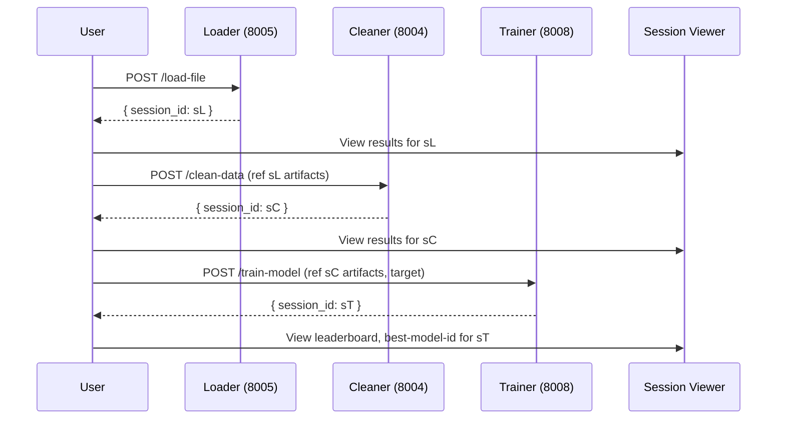
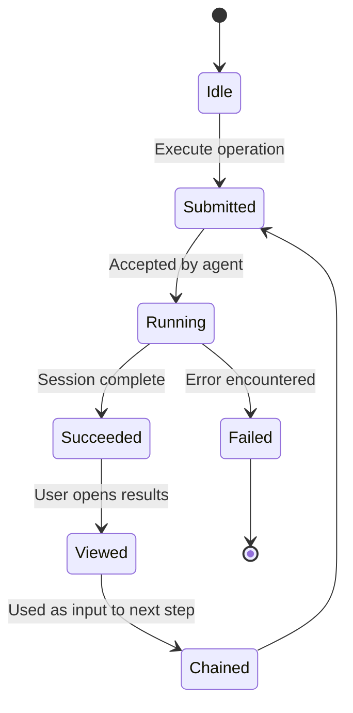

# AI Data Science Platform - Frontend Application Specification (v0.1)

Audience: Product, Design, and Engineering teams building a data science workflow platform.

## Table of Contents
- 1) Executive Summary
- 2) Goals & Non-Goals
- 3) Target Users & Personas
- 4) Core User Journeys
- 5) Information Architecture & Navigation
  - Sitemap (Mermaid)
  - Routing Model
- 6) Key Screens
  - Workflow Dashboard
  - 6 Agent Workspaces (8004–8009)
  - Session Results Viewer
  - Workflow Builder
- 7) Component Catalog
- 8) State Management Strategy
- 9) Data Contracts & API Integration
- 10) Authorization & Roles
- 11) Performance & Accessibility
- 12) Internationalization & Theming
- 13) Offline/Resilience
- 14) Telemetry & Analytics
- 15) Feature Flags & Configuration
- 16) Tech Stack & Architecture
- 17) MVP Scope vs Later Phases
- 18) Risks, Assumptions, Open Questions
- 19) Traceability Matrix
- Next Actions

## 1) Executive Summary
The AI Data Science Platform frontend guides users through a workflow-driven journey: Load → Clean → Visualize → Engineer → Train → Predict. It abstracts complex AI agent capabilities behind specialized, intuitive workspaces while preserving transparency via generated Python code, session-based artifacts, and rich visualizations.

The application integrates directly with six uAgent REST services (ports 8004–8009). Each operation returns a session_id; users explore multi-tabbed results (Data, Code, Logs, Recommendations, Analysis) tied to that session. The platform emphasizes seamless agent chaining, letting outputs from one step become inputs to the next, with real-time feedback for long-running ML tasks.

## 2) Goals & Non-Goals
- MUST: Deliver workflow-driven UX enabling end-to-end data science without writing code.
- MUST: Integrate directly with six uAgents (8004–8009) using the session-based pattern.
- MUST: Provide multi-tab session result viewing (Data, Code, Logs, Recommendations, Analysis).
- MUST: Support dataset uploads (CSV, Excel, JSON, PDF, Parquet) and directory processing.
- MUST: Display generated Python code from agents with syntax highlighting and downloads.
- MUST: Provide real-time progress indicators for long-running tasks (e.g., AutoML training).
- SHOULD: Allow chaining agent outputs (artifacts) into the next agent's inputs with minimal friction.
- SHOULD: Offer workflow templates for common tasks.
- SHOULD: Provide an accessible, responsive UI that scales to medium-large datasets.
- MAY: Include a visual drag-and-drop workflow builder (post-MVP).
- MAY: Add collaboration, session sharing, and advanced analytics in later phases.

Non-Goals (v0.1):
- WILL NOT: Implement complex org/user-level RBAC (session-scoped only).
- WILL NOT: Build an API gateway/orchestrator in frontend (may remain direct-to-agent for MVP).
- WILL NOT: Provide enterprise SSO or multi-tenant admin UX in MVP.

## 3) Target Users & Personas
- Data Scientists: Need rapid prototyping, control over parameters, visibility into generated code.
- Business Analysts: Want insights fast through guided workflows and clear visualizations.
- Domain Experts: Prefer simple instructions and recommendations to shape the workflow.
- Students/Researchers: Learn by observing generated code and transformations over time.

## 4) Core User Journeys
1. Load → Clean → Visualize → Engineer → Train → Predict
   - Upload CSV/Excel/JSON/PDF/Parquet or directory (8005).
   - Clean with recommendations and generated code (8004).
   - Create Plotly visualizations (8006).
   - Engineer new features (8007).
   - Train models via H2O AutoML (leaderboard, best model) (8008).
   - Make single/batch predictions and analyze models (8009).

2. Quick Analysis
   - Load → Auto-clean → Auto-visualize → Review insights and recommended next steps.

3. Model Lifecycle
   - Load → Clean → Engineer → Train → Analyze model → Save session → Predict (batch).

## 5) Information Architecture & Navigation

### Mermaid Sitemap

```mermaid
flowchart TD
    A[Workflow Dashboard]
    B[Data Loader &#40;8005&#41;]
    C[Data Cleaning &#40;8004&#41;]
    D[Visualization &#40;8006&#41;]
    E[Feature Engineering &#40;8007&#41;]
    F[H2O Training &#40;8008&#41;]
    G[Prediction &#40;8009&#41;]
    H[Sessions]

    I[Execute Load → session_id]
    J[Execute Clean → session_id]
    K[Execute Viz → session_id]
    L[Execute Feature Eng → session_id]
    M[Execute Train → session_id]
    N[Execute Predict → session_id]

    O[Session Results Viewer]
    O1[Data]
    O2[Code]
    O3[Logs]
    O4[Recommendations]
    O5[Analysis]
    P[Workflow Builder]

    A --> B
    A --> C
    A --> D
    A --> E
    A --> F
    A --> G
    A --> H
    A --> P

    B --> I
    C --> J
    D --> K
    E --> L
    F --> M
    G --> N

    I --> O
    J --> O
    K --> O
    L --> O
    M --> O
    N --> O

    O --> O1
    O --> O2
    O --> O3
    O --> O4
    O --> O5
```


### Routing Model
- `/` → Workflow Dashboard
- `/agents/loading` → Data Loader Workspace (8005)
- `/agents/cleaning` → Data Cleaning Workspace (8004)
- `/agents/visualization` → Visualization Workspace (8006)
- `/agents/engineering` → Feature Engineering Workspace (8007)
- `/agents/training` → H2O Training Workspace (8008)
- `/agents/prediction` → Prediction Workspace (8009)
- `/sessions/[sessionId]` → Session Results Viewer (tabs: data/code/logs/recommendations/analysis)
- `/workflows` → Workflow Builder (visual chaining; post-MVP enhanced)

## 6) Key Screens

### Workflow Dashboard
- Purpose: Command center with quick-start workflows, six agent entry points, recent sessions.
- Acceptance Criteria
  - Given the app loads, When the user views the dashboard, Then six agent buttons and workflow templates MUST be visible.
  - Given an operation completes, When the user returns, Then the recent sessions list SHOULD show latest sessions.
- Wireframe-Level Layout
  - Header with app title/profile
  - Quick Start Workflows (Analyze, Clean & Visualize, Build ML Model)
  - Six agent buttons with port labels (8004–8009)
  - Recent Sessions list with timestamps
- States: loading (skeletons), empty (no sessions), error (fetch failure), success (lists populated).
- Data Needs: recent session metadata (id, agent, created_at, status), workflow templates.
- Components: `WorkflowDashboard`, `AgentCard`, `WorkflowTemplateCard`, `RecentSessionsList`.
- Responsiveness: grid collapses to 2/1 columns; touch-friendly hit targets.
- Accessibility: keyboard focus order across templates and agent cards; ARIA roles on lists.
- Edge Cases: no network, empty session history, one or more agents unavailable (feature flags).

### 6 Agent Workspaces (Pattern + per-agent specifics)
- Purpose: Specialized UIs to execute operations on each agent and capture a session_id.
- Shared Acceptance Criteria
  - Given parameters are provided, When user clicks Execute, Then a request MUST be sent to the agent and a session_id MUST be captured on success.
  - Given a session_id, When user opts to View Results, Then they SHOULD be routed to `/sessions/[sessionId]`.
- Shared Layout
  - Title + Back to Dashboard
  - Operation configuration (form, file uploader as applicable)
  - Optional instruction text area
  - Execute button with progress indicator
  - Post-execution: "View Results" and "Chain to Next Step"
- States: loading (submission), empty (no file/params), error (validation/network), success (session_id).
- Responsiveness & Accessibility: consistent form patterns; announce busy state on execute.

Agent specifics:
- Data Loader (8005)
  - Inputs: File(s), Directory path, PDF
  - Operations: `POST /load-file`, `POST /load-directory`, `POST /extract-pdf`
  - Artifacts: loaded data, AI message, tool calls, internal messages
  - Components: `FileUploader`, `DirectoryPicker` (optional UI), `ExecuteLoadForm`
- Data Cleaning (8004)
  - Inputs: dataset reference or CSV upload; cleaning instructions; advanced options
  - Operations: `POST /clean-data`, `POST /clean-csv`
  - Artifacts: cleaned data, original data, cleaning function, cleaning steps, workflow summary
  - Components: `DataCleanerForm`, `AdvancedCleaningOptions`
- Visualization (8006)
  - Inputs: dataset reference or CSV; chart spec parameters; optional instructions
  - Operations: `POST /create-chart`, `POST /create-chart-csv`
  - Artifacts: plotly-graph, visualization function, visualization steps
  - Components: `VisualizationForm`
- Feature Engineering (8007)
  - Inputs: dataset reference or CSV; feature goals; constraints
  - Operations: `POST /engineer-features`, `POST /engineer-features-csv`
  - Artifacts: engineered data, engineering function, engineering steps
  - Components: `FeatureEngineeringForm`
- H2O Training (8008)
  - Inputs: dataset reference or CSV; target column; time budget
  - Operations: `POST /train-model`, `POST /train-model-csv`
  - Artifacts: leaderboard, best-model-id, model-path, training function, ml-steps
  - Components: `ModelTrainerForm`, `ProgressIndicator`
- Prediction (8009)
  - Inputs: model reference or loaded model; single/batch input; analysis options
  - Operations: `POST /predict-single`, `POST /predict-batch`, `POST /analyze-model`, `POST /load-model`
  - Artifacts: prediction-results, batch-results, model-analysis
  - Components: `PredictionForm`

### Session Results Viewer
- Purpose: Explore results tied to a session_id via multi-tab interface.
- Acceptance Criteria
  - Given a valid session_id, When the page loads, Then tabs for Data/Code/Logs/Recommendations/Analysis MUST be available (tab presence may vary by agent).
  - Given long-running operations, When polling occurs, Then progress SHOULD be updated until completion or timeout.
- Layout
  - Header: session_id, agent, timestamp, status
  - Tabs:
    - Data: table preview(s), download options
    - Code: generated Python functions
    - Logs: workflow/internal messages
    - Recommendations: AI steps/suggestions
    - Analysis: charts, leaderboards, prediction summaries
- States: loading, empty (not available yet), error (session expired), success.
- Data Needs: all session-based endpoints per agent (see mapping).
- Components: `SessionHeader`, `SessionTabs`, `DataFrameViewer`, `CodeViewer`, `PlotlyChart`, `LeaderboardTable`, `LogsViewer`, `RecommendationsList`.
- Accessibility: tab roles, keyboard navigation, code blocks with accessible copy/download.
- Edge Cases: partial availability (some tabs empty early), large payloads (progressive fetch), expired session (retry/back).

### Workflow Builder
- Purpose: Visually chain agents; manage multi-step pipelines (MVP: simple chaining controls; enhanced versions add drag-and-drop).
- Acceptance Criteria
  - Given selected steps, When user runs the workflow, Then each step SHOULD execute in order and produce session_ids chained forward.
  - Given a step fails, When recovery is possible, Then the user SHOULD be offered retry/skip options.
- Layout
  - Template selection or custom steps
  - Steps panel with parameters summary
  - Execution timeline with live statuses and links to session results
- States: draft, running, paused, completed, failed.
- Data Needs: list of agents, artifacts passing (session outputs → next inputs).
- Components: `AgentChainer`, `WorkflowTimeline`, `WorkflowTemplatePicker`.
- Accessibility: keyboard reordering (later phase), live region for step status updates.

## 7) Component Catalog
- DataFrameViewer
  - Props: `data: DataFrameLike`, `maxRows?: number`, `downloadUrls?: {csv?: string}`
  - Responsibilities: render JSON-safe tables, pagination/virtualization for large sets
  - A11y: table semantics, keyboard navigable cells
- PlotlyChart
  - Props: `figure: PlotlyFigure`, `exportEnabled?: boolean`
  - Responsibilities: render interactive Plotly graphs, export as PNG
  - A11y: descriptive titles/aria-labels, color contrast
- CodeViewer
  - Props: `code: string`, `language: 'python'`, `downloadFileName?: string`
  - Responsibilities: syntax highlight, copy/download
  - A11y: accessible clipboard controls
- SessionManager
  - Props: `sessions: SessionMeta[]`, `onSelect: (id) => void`
  - Responsibilities: list/search sessions
  - A11y: list roles, focus management
- FileUploader
  - Props: `accept: string[]`, `multiple?: boolean`, `onUpload: (files) => void`
  - Responsibilities: drag-and-drop + click upload; show file chips
  - A11y: keyboard-triggered uploads; status announcements
- DataCleaner
  - Props: `params: CleaningParams`, `onExecute: (params) => Promise<SessionId>`
  - Responsibilities: collect options and trigger execution
- ModelTrainer
  - Props: `params: TrainingParams`, `onExecute`, `progress?: ProgressState`
  - Responsibilities: run training; show progress
- AgentChainer
  - Props: `steps: AgentStep[]`, `onRun: () => void`
  - Responsibilities: chain execution and pass artifacts
- ProgressIndicator
  - Props: `status: 'idle'|'running'|'success'|'error'`, `percent?: number`, `eta?: string`
  - Responsibilities: show live progress, esp. for ML training

## 8) State Management Strategy
- Store: Zustand
  - UI state (tabs, selections), workflow steps, activeAgent, upload queues.
  - Session registry: persist `{ sessionId, agentType, createdAt, status, labels }`.
  - Workflow chaining: `sessionChain: {fromAgent, sessionId, artifactsRef}[]`.
- Server state (fetch/poll)
  - Session results are server state; use fetch/polling per agent endpoints.
  - Optimistic updates MAY be used for quick UI feedback; long-running tasks SHOULD use polling with exponential backoff and max timeout per agent type.
- Data flow
  - After each execution: store sessionId + minimal metadata.
  - For chaining: resolve artifacts references from the prior session to build the next request (see Contracts).

## 9) Data Contracts & API Integration
Direct integration with uAgents running on:
- 8004 Data Cleaning
- 8005 Data Loader
- 8006 Visualization
- 8007 Feature Engineering
- 8008 H2O Training
- 8009 Prediction

Session-Based Pattern
- POST main operation → returns `session_id`
- Read results via session endpoints

Endpoint Mapping (from Vision; representative, not exhaustive):
- Data Loader (8005)
  - POST `/load-file`, `/load-directory`, `/extract-pdf`
  - Session access: `/get-artifacts`, `/session/{id}/ai-message`, `/session/{id}/tool-calls`, `/session/{id}/internal-messages`
- Data Cleaning (8004)
  - POST `/clean-data`, `/clean-csv`
  - Session access: `/get-cleaned-data`, `/session/{id}/original-data`, `/session/{id}/cleaning-function`, `/session/{id}/cleaning-steps`, `/session/{id}/workflow-summary`
- Visualization (8006)
  - POST `/create-chart`, `/create-chart-csv`
  - Session access: `/session/{id}/plotly-graph`, `/session/{id}/visualization-function`, `/session/{id}/visualization-steps`
- Feature Engineering (8007)
  - POST `/engineer-features`, `/engineer-features-csv`
  - Session access: `/session/{id}/engineered-data`, `/session/{id}/engineering-function`, `/session/{id}/engineering-steps`
- H2O Training (8008)
  - POST `/train-model`, `/train-model-csv`
  - Session access: `/session/{id}/leaderboard`, `/session/{id}/best-model-id`, `/session/{id}/model-path`, `/session/{id}/training-function`, `/session/{id}/ml-steps`
- Prediction (8009)
  - POST `/predict-single`, `/predict-batch`, `/analyze-model`, `/load-model`
  - Session access: `/session/{id}/prediction-results`, `/session/{id}/batch-results`, `/session/{id}/model-analysis`

Conflict Callout (and Resolution)
- Conflict: Data Cleaning session result uses `POST /get-cleaned-data` (with `{session_id}`) in example code, while most others use `GET /session/{id}/*`.
- Resolution: We SHOULD standardize client behavior around `GET /session/{id}/*` for read-only resources. For endpoints currently only available as `POST /get-cleaned-data`, the frontend will support it now and mark `GET /session/{id}/cleaned-data` as Proposed for backend parity.
- Conflict: NEXT_STEPS_PLAN proposes an API Gateway/orchestration layer; Vision emphasizes direct agent integration. Resolution: Follow Vision (source of truth) for MVP with direct agent clients; treat unified backend orchestration as a Proposed later enhancement.

uAgent Client (TypeScript)
```typescript
type SessionId = string;

interface SessionResponse { session_id: SessionId }

interface LoadFileParams { file: File; instructions?: string }
interface CleanDataParams { sessionOrCsv: {session_id?: string; csvBase64?: string}; instructions?: string }
interface VizParams { sessionOrCsv: {session_id?: string; csvBase64?: string}; spec?: Record<string, unknown> }
interface FeatureParams { sessionOrCsv: {session_id?: string; csvBase64?: string}; goals?: string }
interface TrainingParams { sessionOrCsv: {session_id?: string; csvBase64?: string}; target: string; timeBudgetSec?: number }
interface PredictionParams { model: {session_id?: string; model_path?: string}; input: Record<string, unknown> | Array<Record<string, unknown>> }

interface CleanedDataResponse { data: unknown /* JSON-safe table */ }
interface CodeResponse { code: string }
interface ChartResponse { figure: unknown /* Plotly JSON */ }
interface LeaderboardResponse { rows: Array<Record<string, unknown>> }
interface LogsResponse { messages: string[] }
```

Workflow Chaining (Artifacts Passing)
- Loader → Cleaner: Use loader's artifact reference (data handle) or re-upload CSV if necessary.
- Cleaner → Viz/Feature/Train: Use `session_id` of prior step where agent supports session references.
- Train → Predict: Use `/session/{id}/best-model-id` or `/session/{id}/model-path` as input to Prediction.
- Proposed: Where direct artifact references are unavailable, frontend SHOULD fetch the artifact and pass it explicitly (e.g., CSV bytes), noting potential performance costs.

## 10) Authorization & Roles
- Session-based access only in MVP. No complex RBAC.
- Sessions MAY be tagged with human-friendly labels for discoverability.
- Future (Proposed): user auth and shared sessions.

## 11) Performance & Accessibility
- Performance
  - MUST virtualize large tables in `DataFrameViewer`.
  - SHOULD progressively load large session results (tab-level fetching).
  - SHOULD debounce/pool polling for ML training; limit network load.
  - SHOULD cache recent session metadata in-memory; MAY persist to localStorage.
- Accessibility
  - MUST ensure keyboard navigation for tabs, forms, and tables.
  - MUST meet contrast requirements for charts and code views.
  - SHOULD provide descriptive alt/aria labels for charts and actions.

## 12) Internationalization & Theming
- i18n
  - SHOULD isolate all UI strings; data science terminology consistent with Vision (agents, workflows, sessions, artifacts).
- Theming
  - Tailwind tokens for brand colors:
    - Primary: `#1e40af` (deep blue)
    - Secondary: `#059669` (emerald)
    - Accent: `#f59e0b` (amber)
    - Neutrals: slate grays
- Design Tokens (example)
| Token | Value | Usage |
|---|---|---|
| color.primary | #1e40af | buttons, links |
| color.secondary | #059669 | success states |
| color.accent | #f59e0b | highlights, badges |
| font.header | Inter Bold | titles |
| font.body | Inter Regular | body |
| font.code | JetBrains Mono | code blocks |

## 13) Offline/Resilience
- Long-Running Operations: Poll with exponential backoff; display ETA when available.
- Session Timeouts: Detect expired sessions; show recovery actions (rerun step, reload data).
- Network Failures: Toasts with retry; preserve unsent form data; do not lose session registry.

## 14) Telemetry & Analytics
- Workflow Analytics (non-PII)
  - Agent usage by type
  - Workflow patterns (common chains)
  - Session success/failure and durations
  - Drop-off points (where users stop)
- Metrics Table
| Metric | Definition | Purpose |
|---|---|---|
| time_to_first_insight | Upload → first chart or cleaned data | UX goal: < 2 minutes |
| training_duration | start → completion per session | Perf monitoring |
| session_success_rate | completed sessions / total | Reliability |
| agent_conversion | started → results viewed | Value tracking |

## 15) Feature Flags & Configuration
- Flags
  - `feature.agent.cleaning.enabled` (default true)
  - `feature.workflow.builder.enabled` (default false for MVP)
  - `feature.plotly.export.enabled` (default true)
- Configuration
  - Agent base URLs (e.g., `http://127.0.0.1:8004`…`8009`)
  - Polling intervals and timeouts per agent type

## 16) Tech Stack & Architecture
- Confirmed Stack: Next.js 13+ (app router), TypeScript, Zustand, shadcn/ui, Tailwind CSS, Plotly.js
- uAgent Integration: Direct REST calls to ports 8004–8009; session-based result fetching
- Session Management: Local store of session metadata; link to server-side session content
- Data Visualization: Plotly with full interactivity and export

## 17) MVP Scope vs Later Phases
- MVP (Weeks 1–2)
  - Six agent workspaces with main operations wired
  - Workflow-driven dashboard
  - Session results viewer (multi-tab)
  - Basic workflow chaining (manual or single-click)
  - Plotly chart rendering and code viewer
- Enhanced (Weeks 3–4)
  - Visual drag-and-drop workflow builder
  - Workflow templates
  - Advanced exports, session library, sharing
  - Performance optimizations and end-to-end tests

## 18) Risks, Assumptions, Open Questions
- Risks
  - uAgent availability and stability across six services
  - Large dataset handling (memory and rendering constraints)
  - Session management complexity and expirations
- Assumptions
  - Session-based architecture scales to our needs
  - Users prefer visual workflows over NL interfaces
  - Plotly figures are serializable and performant in-browser
- Open Questions
  - Standardization of session result endpoints (`GET /session/{id}/*` vs POST handlers)
  - Cross-agent artifact references (uniformity of "sessionOrCsv" inputs)
  - Unified error schema across agents (Proposed)

## 19) Traceability Matrix
| Plan Item (NEXT_STEPS_PLAN) | Screen/Component/Feature | Status |
|---|---|---|
| Workflow Dashboard (Week 1) | `WorkflowDashboard`, `AgentCard`, routing | MVP |
| 6 Agent Workspaces (Week 1) | `/agents/*` screens + forms | MVP |
| File Upload System (Week 1) | `FileUploader`, Loader Workspace | MVP |
| Session Management (Week 1) | `SessionManager`, `/sessions/[id]` | MVP |
| Agent Results Display (Week 1) | `SessionTabs` (Data/Code/Logs/Recommendations/Analysis) | MVP |
| Rich Results Viewer (Week 2) | Tabbed display with Plotly, Code, Logs, Leaderboard | Week 2 |
| Workflow Chaining (Week 2) | `AgentChainer`, session artifact passing | Week 2 |
| Real-time Progress (Week 2) | `ProgressIndicator`, polling | Week 2 |
| Visual Workflow Builder (Week 3) | `/workflows`, drag-and-drop | Week 3 |
| Workflow Templates (Week 3) | Template picker on dashboard/workflows | Week 3 |
| Performance & Polish (Week 4) | Virtualized tables, caching, a11y improvements | Week 4 |

## Required Mermaid Diagrams

### Data Science Workflow (Load→Clean→Train)


### Session Management State Flow


## Conflicts Summary and Resolution
- Endpoint Style: Prefer `GET /session/{id}/*` for read-only; support `POST /get-cleaned-data` where required; mark `GET /session/{id}/cleaned-data` as Proposed for parity.
- Orchestration Layer: Vision prioritizes direct uAgent integration; treat gateway/orchestration endpoints as Proposed for later backend enhancement.

## Next.js Routing Overview
| Route | Purpose |
|---|---|
| `/` | Dashboard |
| `/agents/loading` | Data Loader workspace |
| `/agents/cleaning` | Data Cleaning workspace |
| `/agents/visualization` | Visualization workspace |
| `/agents/engineering` | Feature Engineering workspace |
| `/agents/training` | H2O Training workspace |
| `/agents/prediction` | Prediction workspace |
| `/sessions/[sessionId]` | Session Results Viewer |
| `/workflows` | Workflow Builder |

## Next Actions
- Engineering (Week 1)
  - Scaffold routes and screens above using shadcn/ui and Tailwind.
  - Implement `uAgentClient` with base URLs for 8004–8009.
  - Build `FileUploader`, `SessionManager`, `SessionTabs`, `CodeViewer`, `PlotlyChart`.
  - Wire main POST operations for all six agents; capture and store `session_id`.
  - Implement Session Results Viewer with tab-wise fetching and skeleton states.
- Design
  - Finalize dashboard layout, agent cards, and results tab visuals per Vision palette.
  - Provide wireframes for each workspace; define empty/loading/error states.
  - Provide data table and chart accessibility guidelines.
- Product
  - Prioritize workflow templates for "Quick Analysis" and "Build Prediction Model."
  - Define success metrics instrumentation (time_to_first_insight, session_success_rate).
  - Align on conflict resolutions (endpoint standardization; orchestration as later phase).

## Status and Impact
- This specification adheres to FRONTEND_APPLICATION_VISION as the source of truth and aligns with NEXT_STEPS_PLAN milestones. It centers on workflow-driven UX, session-based results, and seamless agent chaining with clear, testable acceptance criteria.
